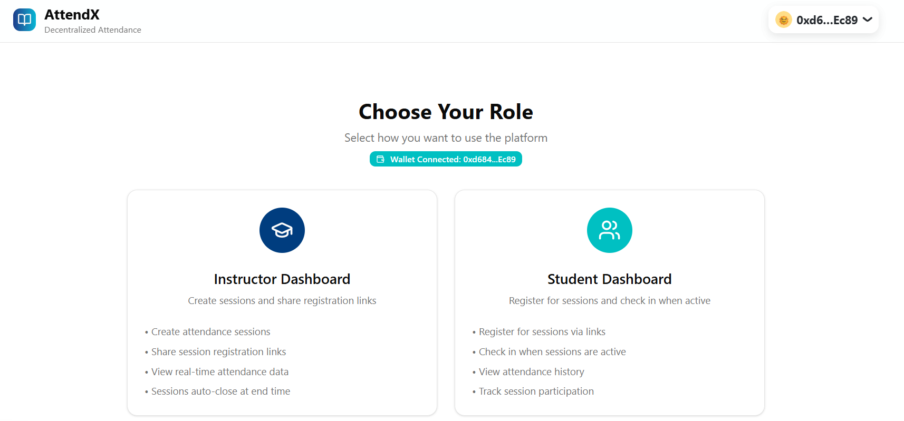

# AttendX 🎓

**Smart Blockchain-Based Attendance Platform for Educational Institutions**

---

## 🌟 Overview  

AttendX is a blockchain-powered attendance tracking system that ensures records are:
- tamper-proof, 
- transparent and 
- reliable

Organizers (instructors or event hosts) can create sessions on-chain, while participants (students or attendees) check in securely, reducing fraud and building trust in digital-first education, training, and events.  

## 🎯 Problem & Solution
### Problem

Attendance fraud (proxy attendance, manipulation)

Time wasted on manual tracking

Lack of transparency in traditional systems

### Solution

Blockchain verification for trust

Automated check-in & reporting

Immutable attendance history for students & institutions

## 🏆 Features

- For Instructors (organisers): Create sessions, track live attendance, generate reports

- For Students (attendees): Simple check-in, view attendance history

- For Institutions: Fraud prevention, compliance-ready records

## 🛠 Tech Stack

- Next.js 15 (React framework)

- TypeScript

- Tailwind CSS v4 + shadcn/ui

- Web3.js / Ethers.js for blockchain integration

- Solidity Smart Contracts

##  🚀 Getting Started
### Prerequisites

- Node.js 18+

- npm or yarn (npm used in this project)

Web3 wallet (MetaMask recommended): defaulted to use lisk for signing

## Setup
### Clone repo
git clone https://github.com/phertyameen/attendX
cd attendx

# Install dependencies
npm install
cd frontend

npm i (again if need be)

# Start dev server
npm run dev

Visit http://localhost:3000 in your browser.

🌐 Deployment

Frontend (Vercel Hosted): attendx.vercel.app

Blockchain Network: Lisk Sepolia Testnet

Smart Contract Address: 0xf84fe45280161504B9e6EE321fF3b9492Cd0a70b

## 📄 License

This project is licensed under the MIT License — see the LICENSE
 file for details.

✨ Built with ❤️ at the Aleph Hackathon

_Built with ❤️ for the future of education_